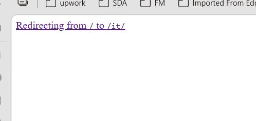

# Fix small bugs

- The redirection to italian language from root `/` to `/it/` isn't smoth and a white page with `Redirecting from / to /it/` is shown. Can you do it more smooth wothout viewing anything?

- on the `Before-after` menu the photos aren't shown on mobile. Maybe this is the effect to not load all the photos. Do a deep research and fix it.

- Can you use `website\public\services-photos\main-photo.jpg` for the forst photo when the service menu is opened.

- Can you add `implantologia zigomatica` in the service menu like other services. use `website\public\services-photos\implantologia zigomatica.jpg` as photo.
